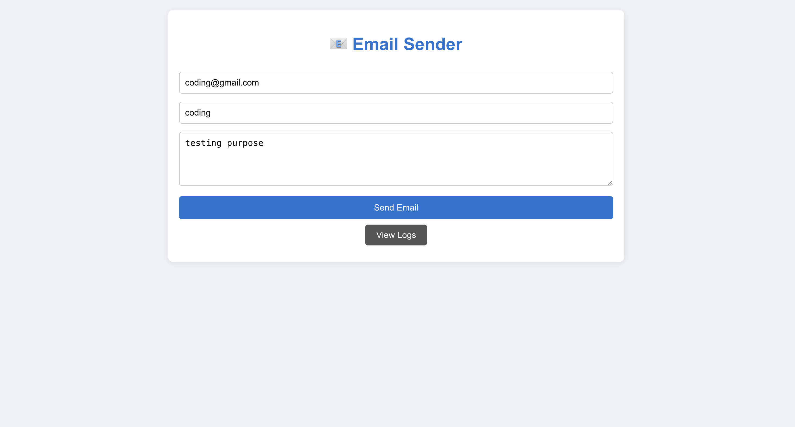
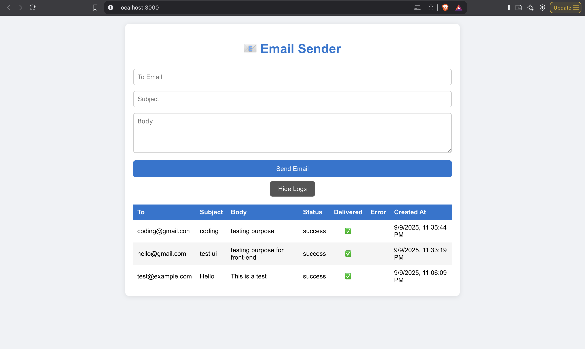

## 📧 Send Email and View Logs

This project allows sending emails and viewing email logs in MongoDB. You can also verify the functionality by taking screenshots of successful email sending and logs.

---



### **Steps to Send an Email**

1. Make sure your server is running:

```bash
npm start
# or
node index.js
POST http://localhost:7000/send
Content-Type: application/json

{
  "to": "recipient@example.com",
  "subject": "Test Email",
  "body": "Hello! This is a test email."
}
GET http://localhost:7000/logs/mongo
[
  {
    "toEmail": "recipient@example.com",
    "subject": "Test Email",
    "body": "Hello! This is a test email.",
    "status": "sent",
    "delivered": true,
    "errorText": null
  }
]


